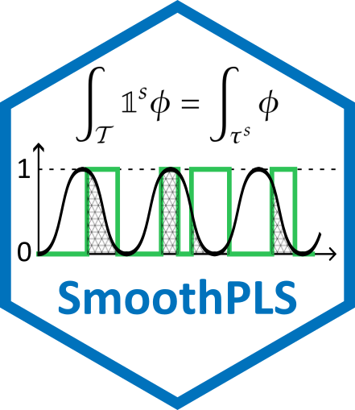
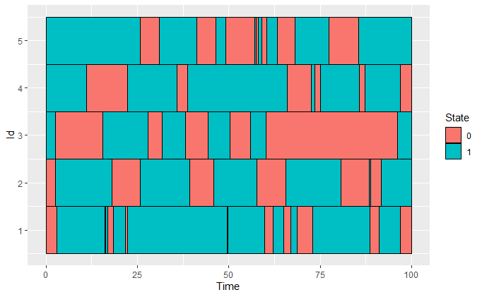
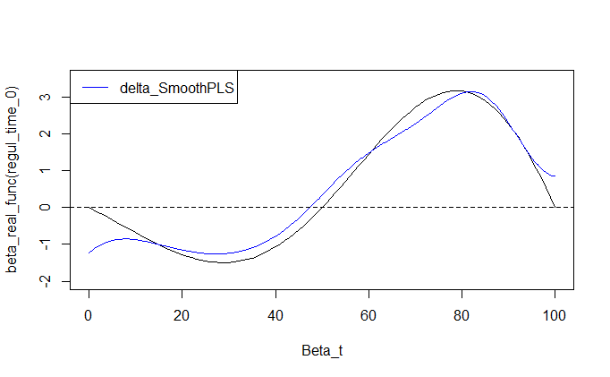

# SmoothPLS 

<!-- badges: start -->
[](https://github.com/FrancoisBassac/SmoothPLS/actions/workflows/R-CMD-check.yaml)
[](https://github.com/FrancoisBassac/SmoothPLS/releases)
[](https://lifecycle.r-lib.org/articles/stages.html#experimental)

[](https://FrancoisBassac.github.io/SmoothPLS/)

[](https://github.com/FrancoisBassac/SmoothPLS/commits/dev)
<!-- badges: end -->

## Overview

**SmoothPLS** is an R package designed for **Hybrid Functional Data Analysis**. It implements a novel approach to Functional Partial Least Squares (FPLS) by integrating categorical functional predictors through the concept of **"Active Area Integration"**.

This work was developed as part of a PhD project at **[DECATHLON](https://www.decathlon.fr/)** in collaboration with **[INRIA](https://www.inria.fr/)**.

### Key Features
- **Smooth PLS**: Integration of categorical states as indicator functions for smoother regression curves.
- **Hybrid Data**: Seamlessly handle both Scalar Functional Data (SFD) and Categorical Functional Data (CFD).
- **Interpretability**: Provides regression curves $\beta$ even for discrete state changes.
- **Comparison Suite**: Built-in functions to compare results with Naive (discretized) PLS and Standard Functional PLS.

---

## Mathematical Intuition

The core innovation lies in treating categorical predictors not as simple dummy variables, but as functional indicator functions $\mathbb{1}^k_t$. The model computes components by integrating over the specific intervals where a state is present:

$$\Lambda_{k,j} = \int_{T} \mathbb{1}_{\{X(t) = s_k\}} \phi_j(t) dt = \int_{\tau_k}  \phi_j(t) dt, \quad \text{with} \quad \tau_k = \lbrace \in \mathcal{T}, X(t) = s_k\rbrace$$

This ensures that the smoothing process respects the physical reality of state transitions while maintaining the continuous framework of Functional PLS.

---

## Installation
Currently in development. Install the latest stable version using:
```R
# install.packages("devtools")
devtools::install_github("FrancoisBassac/SmoothPLS")
```

---

## 📖 Documentation

The complete package documentation—including function references, detailed vignettes, and usage examples—is available online:

[](https://FrancoisBassac.github.io/SmoothPLS/)

👉 **[Explore the SmoothPLS documentation website](https://FrancoisBassac.github.io/SmoothPLS/)**

---

### What's inside?
* **Reference**: Comprehensive manual for all functions (including `smoothPLS`, `funcPLS`, and `naivePLS`).
* **Articles (Vignettes)**: Step-by-step tutorials, such as the comparison of PLS methods for Categorical Functional Data (CFD).
* **Getting Started**: Quick installation guide and basic usage.

---

## 🚀 Quick Start Example

Based on the single-state CFD vignette, here is how to fit and compare models:

```R
library(SmoothPLS)

# 1. Generate Synthetic Data
df_x <- generate_X_df(nind = 100, curve_type = 'cat')
Y_df <- generate_Y_df(df_x, curve_type = 'cat', 
                      beta_real_func_or_list = beta_1_real_func)

# 2. Fit Smooth PLS Model
basis <- create_bspline_basis(start = 0, end = 100, nbasis = 10)
spls_model <- smoothPLS(df_list = df_x, Y = Y_df$Y_noised, 
                        basis_obj = basis, curve_type_obj = 'cat')

# 3. Predict and Visualize
preds <- smoothPLS_predict(df_x, spls_model$reg_obj, curve_type = 'cat')
plot(spls_model$reg_obj$CatFD_1_state_1, main="SmoothPLS Regression Curve")
```

---
### ⚡ Performance Tuning: Parallel Processing

By default, `SmoothPLS` uses the `future` framework to automatically parallelize the heavy numerical integration steps (Lambda matrix evaluation) when `parallel = TRUE`. 

To prevent performance degradation (overhead) on smaller datasets, the package uses **dynamic load balancing**. Instead of a simple binary ON/OFF switch, it calculates an optimal number of background workers required for your specific task to maximize efficiency.

The default threshold is set to **2500 integral evaluations per core**. The engine will recruit one core for every 2500 integrals (calculated as *Individuals* $\times$ *Basis functions*). For example:
* **Under 2,500 integrals:** The model runs sequentially (1 core) to avoid unnecessary setup overhead.
* **5,000 integrals:** The engine spins up exactly 2 cores.
* **Massive datasets (e.g., 50,000+ integrals):** The engine recruits the maximum number of available cores on your machine (*always leaving 2 cores free to keep your operating system responsive*).

You can manually adjust this threshold based on your specific hardware (e.g., lower it if you are on a UNIX system with low forking overhead) by setting a global option before running your model:
```R
# Lower the threshold to 500 evaluations per core
options(SmoothPLS.parallel_threshold = 500)
```

---

## 🔗 Some Links

### 👟 Industrial Partners & Applications
* **[Decathlon](https://www.decathlon.fr/)** – Main industrial partner.
* **[Decathlon SportsLab](https://engagements.decathlon.fr/le-sportslab-notre-labo-danalyse-du-corps-du-ou-de-la-sportif-ve)** – The research and development center.
* **Kiprun Pacer** – The training application using advanced running data:
    * [Official Website](https://www.kiprun.com/)
    * [App Store / Play Store](https://pacer.kiprun.com/)

### 🔬 Research Institutions
* **[Inria](https://www.inria.fr/)** – National Institute for Research in Digital Science and Technology.
* **[Inria Dataverse](https://www.inria.fr/fr/datavers)** – The research team specialized in stochastic modeling and data analysis.

---

## 🗺️ Roadmap & Future Releases

**SmoothPLS** is actively developed. The upcoming updates focus on computational efficiency and expanding the model's theoretical capabilities:

* **[v0.1.4] Parallel Processing:** Implementation of multicore computing to drastically reduce integration time for large datasets (e.g., thousands of Active Areas).
* **[v0.1.5] Hybrid Data Framework:** Support for integrating standard non-functional covariates (e.g., user age, weight) alongside Categorical and Scalar Functional Data.
* **[v0.2.0] Penalized Splines (Univariate):** Addition of roughness penalties to the B-spline coefficients to increase model robustness against noisy kinematic data.
* **[v0.2.1] Penalized Splines (Multivariate):** Extension of the penalized framework to the full multivariate model.

---

## A detailed example : One-State Categorical Functional Data

This example illustrates how SmoothPLS processes Categorical Functional Data (CFD) by modeling transitions as functional objects. 
For a deeper dive, see the [full vignette](https://francoisbassac.github.io/SmoothPLS/articles/s01_CFD_one_state.html).

1. Data Visualization
We simulate categorical time series where individuals switch between state 0 and state 1 over time.

### Generate synthetic categorical data
```R
library(SmoothPLS)

df_x <- generate_X_df(nind = 100, start = 0, end = 100, curve_type = 'cat')
```

### Visualize the first 5 individuals
```R
plot_CFD_individuals(df_x, by_cfda = TRUE)
```



2. Model Fitting & Prediction
We fit the SmoothPLS model to a noised response $Y$ and compare the resulting regression curve $\beta(t)$ with the ground truth.

```R
# Define a B-spline basis
basis <- create_bspline_basis(start = 0, end = 100, nbasis = 10)
plot(basis)
```


### Generate response Y linked to the time spent in state 1
```R
Y_df <- generate_Y_df(df_x, curve_type = 'cat', 
                      beta_real_func_or_list = beta_1_real_func)
```

### Fit the SmoothPLS model
```R
spls_obj <- smoothPLS(df_list = df_x, Y = Y_df$Y_noised, 
                      basis_obj = basis, curve_type_obj = 'cat',
                      print_steps = FALSE, print_nbComp = FALSE, 
                      plot_rmsep = FALSE, plot_reg_curves = FALSE)
```

### Plot the recovered regression curve vs the theoretical one
```R
# Extract parameters for plotting
delta <- mod_seq$reg_obj$CatFD_1_state_1
regul_time_0 <- seq(0, 100, length.out = length(delta))

y_lim = eval_max_min_y(f_list = list(beta_real_func, 
                                     delta), 
                       regul_time = regul_time_0)

plot(regul_time_0, beta_real_func(regul_time_0), type='l', xlab="Beta_t",
     ylim = c(-2, 3.5))
plot(delta, add=TRUE, col='blue')
legend("topleft",
         legend = c("delta_SmoothPLS"),
         col = c("blue"),
         lty = 1,
         lwd = 1)
```

